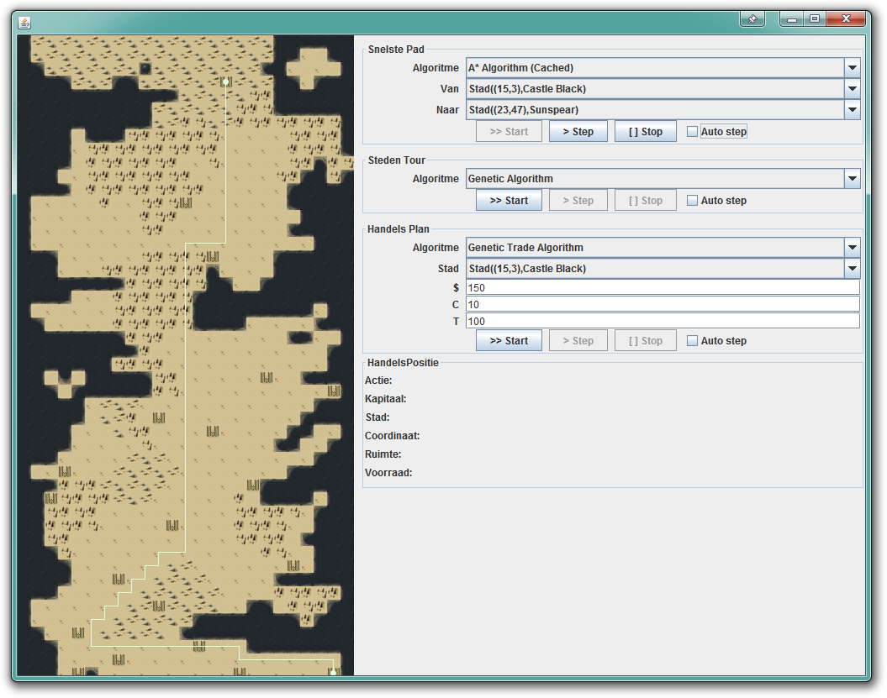
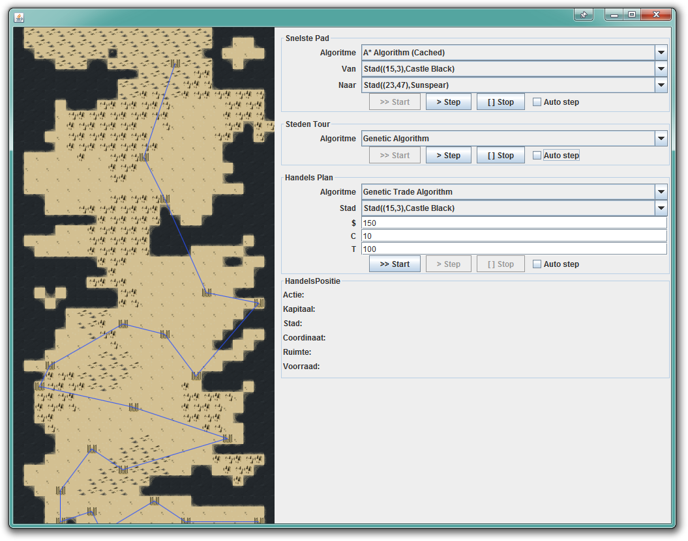
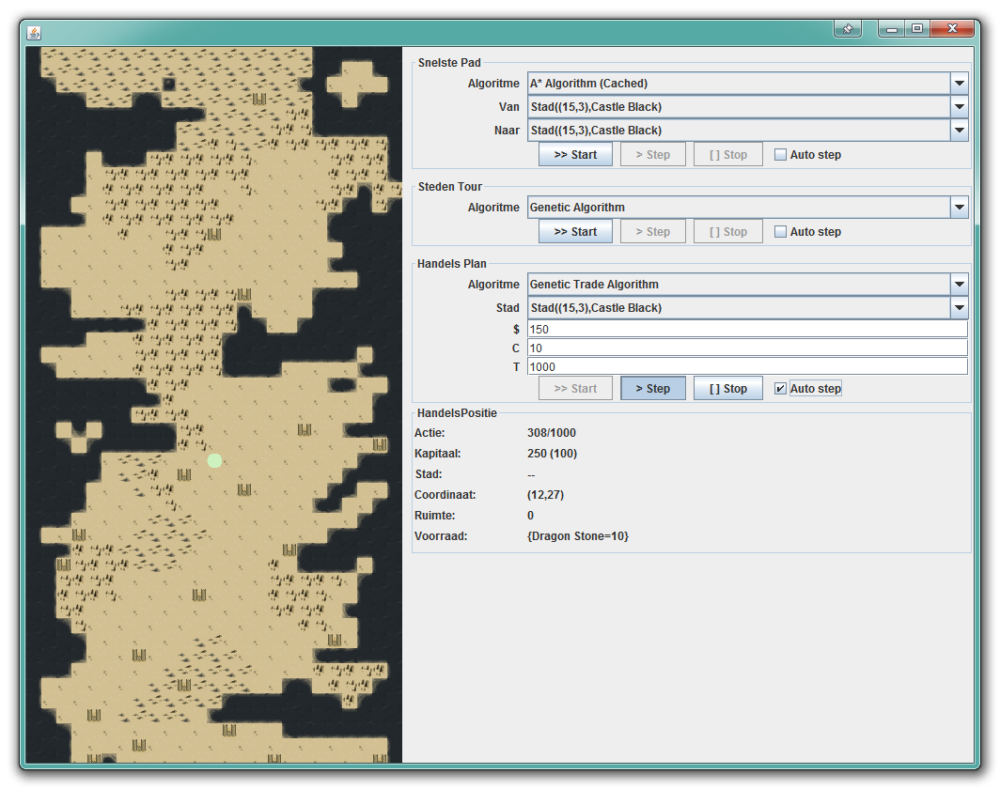
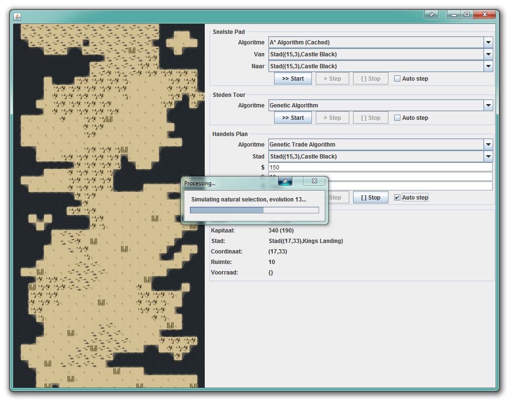

# Game of Trades - Trade route algorithm
_Version: 0.0.1._  
_Licence: [Apache License](LICENSE)_

Project to write algorithms for three logistical problems.
With the goal to write an efficient algorithm, that takes minimum time to calculate it's route.

This project/challenge was part of a study at The Hague University.

Information about used algorithms, see: [Slides](https://timvisee.github.io/GameOfTrades-Project/doc/slides/index.html)
Information about project/challenge, see: [Project Readme](README-Project.md), [Challange](OPDRACHT.md) _(Dutch)_

## Challenge summary
A map, with a list of cities is given. The cities are, of course, located on the map. Each city may have goods it demands or offers for specific prices.
The used libraries include a tool to visually render the map, along with the results and actions each algorithm takes.

### First Challenge: Shortest Path
The first challenge, is to write an algorithm to find the shortest path between two given cities. The map is divided into a grid, where each tile has a different movement cost. Mountains take more time to traverse than grassland.

### Second Challenge: Salesman Route
The second challenge, is to find the most efficient route to visit all cities at least once. The route must start, and end at once of the cities.

### Third Challenge: Trade Route
The third challenge, is to find the most profitable route for a salesman to make the most money in the least amount of time.
The maximum number of time/actions and the starting city is given.

## Screenshots

## Build
The project includes a maven `pom.xml` configuration that can be used to build and test the project.

## About
The project is commissioned by college, as part of a computer science study. For this study, we we're part of team 49.

Developers:
- Nathan Bakhuijzen ([GitHub](https://github.com/nathanbakhuijzen))
- Tim Visée ([GitHub](https://github.com/timvisee), [Website](https://timvisee.com/))
- Simon Haasnoot ([GitHub](https://github.com/simonhaasnoot))

Various libraries and kits were used for this problem:
- GameOfTrades-Library ([GitHub](https://github.com/gameoftrades/gameoftrades-library)): _Library providing the visual interface, and application framework._
- GameOfTrades-Student-Kit ([GitHub](https://github.com/gameoftrades/gameoftrades-student-kit)): _Base kit this project was build on._
- JUnit: _Used for unit testing purposes._

Original repository: [gameoftrades/got-team49](https://github.com/gameoftrades/got-team49) _(May be private/inaccessible)_
